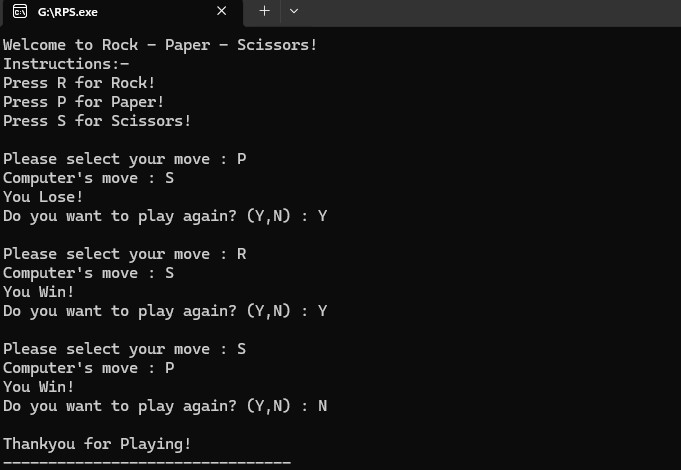

##​🪨📄✂️ C Rock-Paper-Scissors Game 

​This repository hosts a classic implementation of the Rock-Paper-Scissors game, developed entirely in the C programming language. It's a simple, console-based application designed to be lightweight, fast, and easy to compile and run on various platforms. Challenge the computer to a series of rounds and see if you can become the ultimate champion!

​##✨ Features ​Classic Gameplay: Standard Rock-Paper-Scissors rules are implemented. ​Computer AI: A simple, non-predictive random number generation system is used for the computer's moves, ensuring fair and unpredictable matches. ​Score Tracking: The game tracks and displays the current score for both the player and the computer. ​Best-of-N Rounds: Players can choose how many rounds they wish to play (e.g., Best of 3, Best of 5) to determine the match winner. ​Clear Console Interface: Uses standard C printf and scanf functions for a clean and simple command-line user experience. ​Portable Code: Written using standard C libraries (stdio.h, stdlib.h, time.h), making it highly portable.
##gameplay

